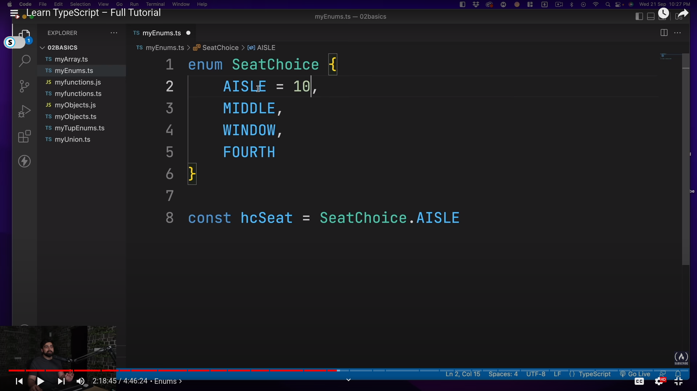
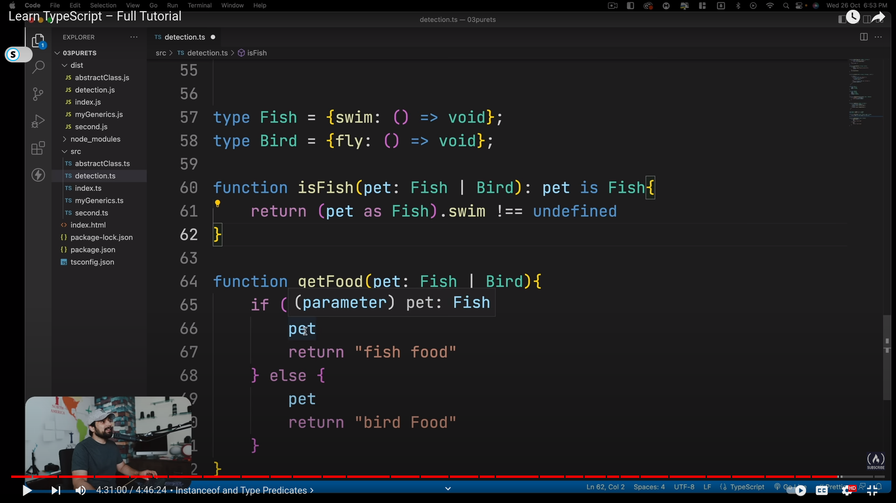

# Goal-Typescript

## Turing complete language:

### Typesystem is also turing complete: Meaning using only type declaration statements, you cac do actual computations

### Type level program: A program that has only type declaration statements in it.---> So when you compile it, The generated js file should be empty.

### The infer keyword:    

#### Revrese a type: 

#### get a tuple of length n using type(convert number into tuples!): 

#### Fibonacci: 

#### Quick Sort: 
